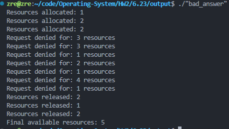

# HW2: Operating System Concepts

This directory contains implementations and tests for various operating system concepts, including PID management, multithreading, and synchronization.

## Structure

- `pid_manager/`: Contains the implementation and tests for PID management.
  - `pid_manager.c`: Implementation of PID allocation and release.
  - `pid_manager.h`: Header file defining the PID management interface.
  - `test_pid_manager.cpp`: Unit tests for PID management using Google Test.
  - `Makefile`: Build and test automation for the PID manager.

- `fibonacci.c`: A multithreaded program to compute Fibonacci numbers.

- `6.23/`: Contains examples of race conditions and their solutions.
  - `question.c`: Demonstrates a race condition in resource management.
  - `bad_answer.c`: Simulates resource allocation without proper synchronization.
  - `answer.c`: Provides a solution using mutexes and condition variables.

## Building and Running

### PID Manager

1. Navigate to the `pid_manager` directory:
   ```bash
   cd pid_manager
   ```

2. Build and run the tests:
   ```bash
   make
   ```

3. Clean up build artifacts:
   ```bash
   make clean
   ```

4. Install Google Test if not already installed:
   ```bash
   make install_gtest
   ```


### Fibonacci Program

1. Compile the program:
   ```bash
   gcc -pthread fibonacci.c -o fibonacci
   ```

2. Run the program:
   ```bash
   ./fibonacci <number_of_terms>
   ```
   


### Race Condition Examples

1. Compile and run `bad_answer.c`:
   ```bash
   gcc -pthread bad_answer.c -o bad_answer
   ./bad_answer
   ```

2. Compile and run `answer.c`:
   ```bash
   gcc -pthread answer.c -o answer
   ./answer
   ```



## Notes

- Ensure you have `gcc`, `make`, and `Google Test` installed on your system.
- For multithreaded programs, use a system with sufficient resources to avoid contention.
